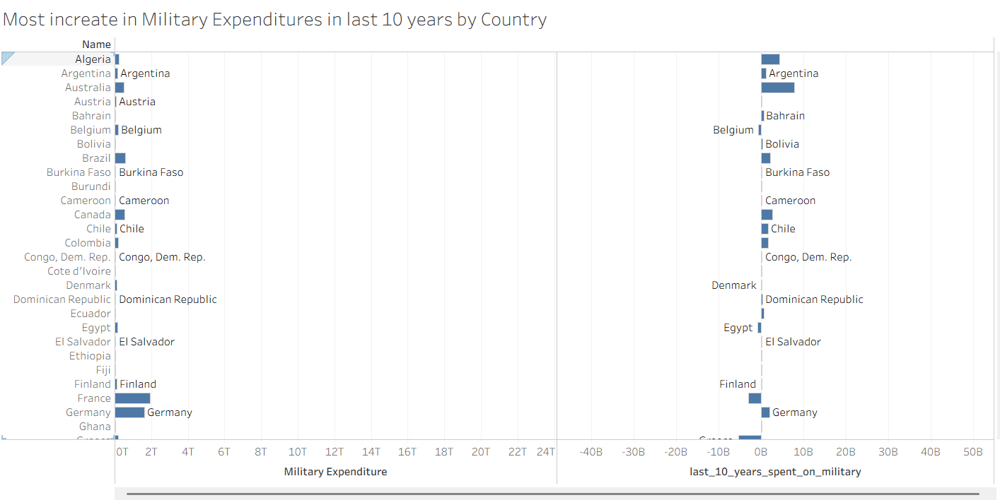

# Military_Expenditure_Data_Analysis_Project_Documentation

### Project: 
Military Expenditure Analysis (1960 - 2018)

---

### Author:
Hadisa Fatima Syed (Role: Data Analysis Enthusiast and BE Software Student)

---

### Project Start Date:                                        
26 June, 2025

---

### Project End Date:
12 July, 2025

---

### Project Overview:
This project presents a comprehensive analysis of global military expenditure from 1960 to 2018, using data from various countries and regions. The dataset includes annual military spending figures in current USD, allowing for a historical exploration of defense investments over nearly six decades.

The primary objective is to uncover trends, patterns, and insights about how different countries and economic regions have allocated military budgets, highlighting the evolution of global defense priorities. The project involves thorough Exploratory Data Analysis (EDA), including statistical summaries, outlier detection, and missing value treatment, followed by visual analytics using Tableau/Tabulae to support key findings.

---

### Objective/Problem Statement:
The goal of this project is to analyze global military spending trends over time using historical expenditure data (1960–2018). The analysis aims to identify top-spending countries, regional patterns, year-over-year growth, and budget priorities.

---

### Dataset Info:
- The cleaned dataset has 109 rows and 59 columns in Wide Format.
- The cleaned dataset has 6373 rows and 5 columns in Long Format.
- This Dataset has 4 types Geographic Locations.
- The Dataset is a Microsoft Excel (.xlsx) file.

---

### Questions:
1. Which country/Region/Place has the highest and lowest total military expenditure so far?
2. Which country/Region/Place has the highest and loweset average military expenditure so far? 
3. Which type of countries has the highest expenditure?  
4. which year had the highest global military spending?   
6. Which country has had the most increase in spending in the last 10 years?
7. What is the trend of global spending across decades?
8. What is the total of top 5 spenders as a % of global spend?

--- 

### Tools and Technologies:
1. Google Sheets (for storing the Original and Cleaned Dataset and for performing Data Cleaning Process)
2. Google Docx (For Creating Scope of Work document and Analytical Report).
3. Tabulae (For creating Visualizations).
4. GitHub (For Doucmenting the entire project in this README.md file, documenting the growth of the project day by day by creating and managing Changelog.md file and for Uploading all the Deliverables).

---

### Data Preprocessing/Cleaning Process:
1. Calculated the Missing Values percentage per Row. If the percentage was less than or equal to 20% then those countries were kept in the dataset else were dropped.
2. Used Conditional Formatting to highlight the cells with missing value % greater than 20 and dropped the corresponded rows, i.e 154 rows out of 265.
3. Dropped 2 more rows, as they contained ‘0’ as their military expenditure for all the years. With this, there are 109 total rows left in the dataset.
4. Missing value cells were filled out using the average of known Expenditure values for each country.
5. Placed each coutries Average Expenditure values in their corresponded empty cells and that change was reflected in the Missing cells % Column.
7. After the all average values were placed, all the values in the Missing value cells % column became '0.005', therefore tht column along with Average Expenditure column was dropped.
8. The Dataset had no Duplicated Values.
9. Dropping 'Indicator Name' Column as it is just reflects the currency type which is same for all the countries, i.e USD, and this is reflected from the a specific Expenditure value of the country.
10. Converting the Cleaned dataset into Long Format from Wide Format.

---

### EDA Process:
1. Calculated Min, Max, Average, Median and Sum Countrywise and year wise.
2. Created Necessary Visualizations.
3. Analyzed the Results from Visualizations.

---

### EDA Summary:
1. 'High Income' has the highest Total Expenditure.
2. 'Mauritius' has the lowest Total Expenditure.
3. In the year 2015, Total Military Expenditure by year was the highest.
4. In the year 1960, Total Military Expenditure by year was the lowest.
5. In the year 2016, Average Military Expenditure was the highest.
6. By type, 'Regions Clubbed Economically' was the highest, whereas, 'CAN' was the lowest.
7. Within Top 10 Military Spenders, 'Regions clubbed Economically' has highest Total and 'CAN' is not part of Top 10.

---

### Visualizations:
1. Average Spent on Military by Country (Highest to Lowest)

2. Last 10 years' spend by Country

3. Spent over Decades

4. Top 5 Countries as % of Global Spent

---

### Limitations:
- Dataset was outdated
- All the countries were not included
- It had a lot of missing values

---

### Conclusion:
This analysis of global military expenditure across countries and decades reveals critical patterns in defense spending. The data highlights that High-Income countries and regions clubbed economically consistently dominate global military expenditures, with countries like the United States and Arab World leading in both total and average spending.

A decade-wise analysis shows a significant upward trend, especially from the 2000s onwards, reflecting growing defense budgets in response to geopolitical, economic, and technological developments. While some low-income or conflict-affected countries maintain comparatively minimal expenditures, their inclusion emphasizes the global distribution and disparity of defense priorities.

Through data cleaning, exploration, and visualization using tools like Google Sheets and Tabulae, this project offers a structured and insightful overview of how military spending has evolved over time. It also demonstrates the importance of maintaining data integrity, performing thorough EDA, and crafting visual narratives that inform and engage diverse audiences — from policymakers to data enthusiasts.

---

### Key Takeaways:
- Understand the dataset, why a column exist, what questions can be derived or answered using each column.
- Always have time related data, years in this dataset, in rows and never in columns.
- Understood why EDA and its corresponded Visuals are necessary.
- Data Cleaning Techniques especially when a dataset has so many empty cells.
